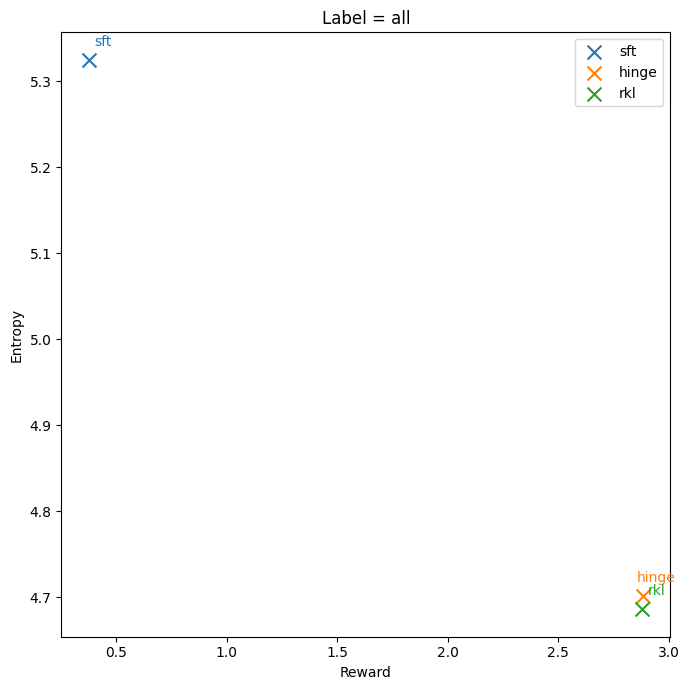
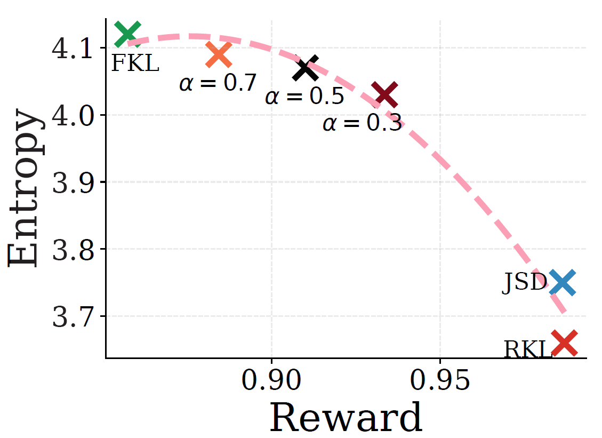
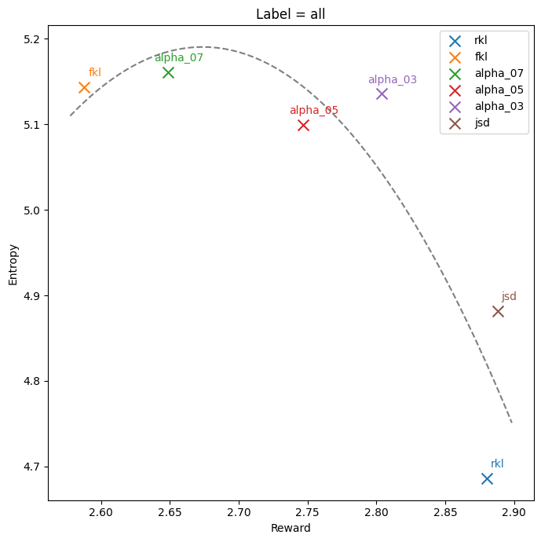
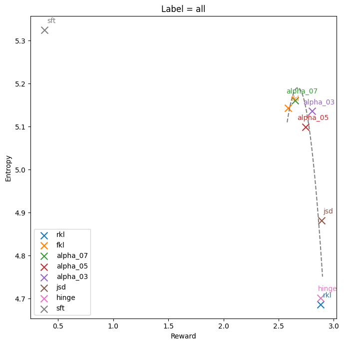
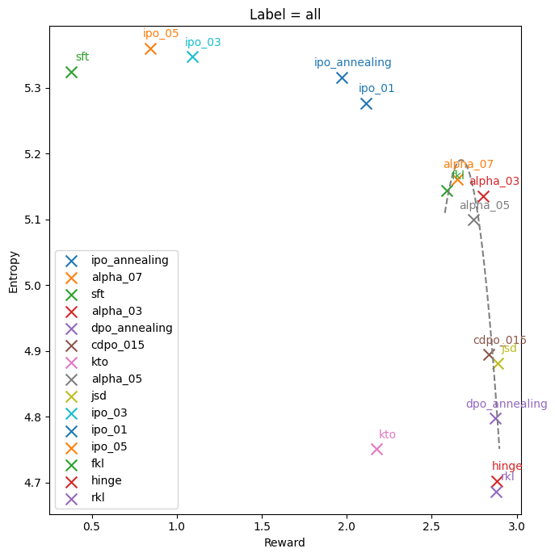

# TLab.NLP Тестовое 23Q4

## Содержание
- [Введение](#введение)
- [Данные](#данные)
  - [Обучающие данные](#обучающие-данные)
  - [Тестовые данные](#тестовые-данные)
- [Анализ и выводы](#анализ-и-выводы)
  - [Level 1](#level-1)
  - [Level 2](#level-2)
  - [Level 3](#level-3)
- [Установка и воспроизводимость](#установка-и-воспроизводимость)
  - [Окружение](#окружение)
  - [Воспроизводимость](#воспроизводимость)
- [Ссылки](#ссылки)
- [Структура проекта](#структура-проекта)
- [Лицензия](#лицензия)

## Введение
Исследование Alignment техник на основе DPO, исследование закономерности разнообразия генераций в зависимости от выбранных мер близости распределений и способов оптимизации.

## Данные

### Обучающие данные
Использованы данные, сгенерированные на основе 2268 уникальных промптов, выбранных из обучающего набора данных [IMDB](https://huggingface.co/datasets/imdb). Модель `gpt2-imdb` использовалась для генерации ответов на каждый промпт. Каждый ответ ограничивался максимумом в 256 токенов, при этом промпты имели ограничение в 32 токена. Из всех сгенерированных ответов были отфильтрованы те, длина которых составляла менее 10 токенов, в результате чего было получено 17344 подходящих семпла. Эти данные использовались для создания 59086 пар `winner-loser` на основе оценок модели `DistilBERT-imdb`.

### Тестовые данные
500 случайных промптов из тестовой части набора данных [IMDB](https://huggingface.co/datasets/imdb). Дообученная модель `gpt2-imdb` сгенерировала по 25 ответа на каждый промпт, после чего проводилась фильтрация, исключающая ответы длиной менее 10 токенов.

## Анализ и выводы

Более подробная методология и описание представлено в [`report`](./reports/report.pdf).
### Level 1
Основной вывод заключается в том, что `SFT` показывает выше разнообразие ответов по сравнению с SLiC-HF (`hinge` loss) и DPO (`sigmoid` loss/`RKL`). Модель `hinge` обучена различать положительные и отрицательные примеры, в то время как `RKL` сходится к предпочтениям человека, Напрямуб оптимизируя правдоподобие, рискуя переобучением.

<div align="center">
  
</div>

### Level 2

Сравнение f-дивергенций показывает, что `FKL` способствует более равномерному распределению ответов, а `RKL` и `JSD` концентрируются на одной моде. Анализ энтропии по уникальным промптам показывает меньшую вариативность у $\alpha$-divergence = 0.5, что не сходится с результатами [референсной статьи](https://arxiv.org/pdf/2309.16240v1.pdf).

<div align="center">
    
    
</div>

*resource: https://arxiv.org/pdf/2309.16240v1.pdf*

Сравнение с SFT и SLiC-HF методами дают ожидаемые результаты: SFT не настроена на награду и имеет большое разнообразие, `Hinge` близок к обычному DPO (`RKL`).

<div align="center">
  
</div>

### Level 3
Цель — достичь баланса между выравниванием под человеческие предпочтения и разнообразием. IPO с разными значениями $\beta$ и cDPO с малым $\epsilon$ показывают улучшение в разнообразии. Техника Annealing (`DPO Annealing` и `IPO Annealing`) продемонстрировала различное поведение, с меньшим разнообразием для DPO.

<div align="center">
  
</div>

### Выводы

- `DPO` подвержено переобучению, ведущему к снижению разнообразия.
- Методы `IPO` и `cDPO` могут служить регуляризаторами для DPO, снижая переобучение.
- Рассмотрение дополнения Adversarial Loss может улучшить разнообразие при сохранении оптимизации под человеческие предпочтения ([APO]((https://arxiv.org/abs/2311.08045))).

## Установка и воспроизводимость
Инструкции по установке и запуску проекта, а также по шагам для воспроизводимости результатов представлены в соответствующих разделах.

### Окружение
- Список зависимостей расположен в файле `requirements.txt`.
- Во время работы использовался следующий docker образ `pytorch:2.1.1-cuda12.1-cudnn8-devel`

Для настройки среды необходимо сделать следующиее находясь в корне проекта:
```
pip install -e .
pip install -r requirements.txt
```

### Воспроизводимость
- Вся последовательность комманд, начиная с level 1 по level 3 находится в файле `run.sh` с необходимыми комментариями.
- Данные проекта можно скачать и разархивировать в каталог `./data`
- Получение графиков производилось в `./notebooks/evaluation.ipynb`

## Ссылки
В разделе представлены ссылки на используемые данные и модели, логи экспериментов, а также основные исследовательские статьи.


- [Описание задания](https://edu.tinkoff.ru/media/edu-files-ext/tlab_nlp_testovoe_23q4-cca83e79-67a9-4ff4-b2fd-6b078e0929e6.pdf)
- [GPT SFT policy model](https://huggingface.co/lvwerra/gpt2-imdb) - IMDB GPT2
- [Reward model](https://huggingface.co/lvwerra/distilbert-imdb) - DistillBERT IMDB sentiment
- [WandB](https://wandb.ai/myashka/tk_nlp) - логи экспериментов, графики обучения и валидации
- [data](https://drive.google.com/file/d/1JOTgn_ap1kbENWzu2EiHaqrAaNSsiTN-/view?usp=sharing) - zip архив с данными проекта 

**Hugging Face**

*Level 1*
- [IMDB Constractive dataset](https://huggingface.co/datasets/Myashka/gpt2-imdb-constractive) - репозиторий с набором данных, используемым в проекте
- [gpt-hinge-beta_0.1](https://huggingface.co/Myashka/gpt-imdb-hinge-beta_0.1) - Модель обученная с hinge loss
- [gpt-sigmoid-beta_0.1](https://huggingface.co/Myashka/gpt-imdb-sigmoid-beta_0.1) - Модель обученная с sigmoid loss (standart DPO)

*Level 2*
- [gpt-fkl-beta_0.1](https://huggingface.co/Myashka/gpt-imdb-fkl-beta_0.1) - Модель обученная с FKL дивергенцией
- [gpt-jsd-beta_0.1](https://huggingface.co/Myashka/gpt-imdb-jsd-beta_0.1) - Модель обученная с JSD дивергенцией
- [gpt-alpha_0.7-beta_0.1](https://huggingface.co/Myashka/gpt-imdb-alpha_0.7-beta_0.1) - Модель обученная с $\alpha=0.7$ дивергенцией
- [gpt-alpha_0.5-beta_0.1](https://huggingface.co/Myashka/gpt-imdb-alpha_0.5-beta_0.1) - Модель обученная с $\alpha=0.5$ дивергенцией
- [gpt-alpha_0.3-beta_0.1](https://huggingface.co/Myashka/gpt-imdb-alpha_0.3-beta_0.1) - Модель обученная с $\alpha=0.3$ дивергенцией

*Level 3*
- [gpt-ipo-beta_0.1](https://huggingface.co/Myashka/gpt-imdb-ipo-beta_0.1) - Модель обученная с IPO loss ($\beta=0.1$)
- [gpt-ipo-beta_0.3](https://huggingface.co/Myashka/gpt-imdb-ipo-beta_0.3) - Модель обученная с IPO loss ($\beta=0.3$)
- [gpt-ipo-beta_0.5](https://huggingface.co/Myashka/gpt-imdb-ipo-beta_0.5) - Модель обученная с IPO loss ($\beta=0.5$)
- [gpt-cdpo_0.15-beta_0.1](https://huggingface.co/Myashka/gpt-imdb-cdpo_0.15-beta_0.1) - Модель обученная с cDPO loss с $\epsilon=0.15$
- [gpt-dpo_annealing](https://huggingface.co/Myashka/gpt-imdb-dpo_annealing) - Модель обученная с DPO Annealing
- [gpt-ipo_annealing](https://huggingface.co/Myashka/gpt-imdb-ipo_annealing) - Модель обученная с IPO Annealing

**Основные статьи**
- [RLHF](https://arxiv.org/abs/2203.02155)
- [DPO](https://arxiv.org/abs/2305.18290)
- [SLiC-HF](https://arxiv.org/pdf/2305.10425.pdf)
- [DPO c f-дивергенциями](https://arxiv.org/pdf/2309.16240v1.pdf)
- [RSO](https://arxiv.org/abs/2309.06657)
- [IPO](https://arxiv.org/abs/2310.12036)
- [cDPO - label smoothing for human feedback](https://ericmitchell.ai/cdpo.pdf)

**Дополнительно про Alignment**

- [Residual Q-learning (Q*)](https://arxiv.org/pdf/2306.09526.pdf)
- [Implicit language Q-learning (ILQL)](https://sea-snell.github.io/ILQL_site/)
- [PPO with f-divergences](https://arxiv.org/abs/2302.08215)
- [APO - WGAN and Alignment](https://arxiv.org/abs/2311.08045)
- [Reward rAnked FineTuning (RAFT)](https://arxiv.org/abs/2304.06767)
- [Rank Responses to align Human Feedback (RRHF)](https://arxiv.org/abs/2304.05302)
- [(IN-)CONSISTENCY on RLHF](https://arxiv.org/abs/2309.16155v1)
- [RLAIF](https://arxiv.org/abs/2309.00267)
- [Nash HF](https://arxiv.org/abs/2312.00886)
- [MODPO](https://arxiv.org/abs/2310.03708)

## Структура проекта
Проект включает конфигурационные файлы, данные, ноутбук для анализа и скрипты для обработки и обучения моделей. Детальное описание структуры представлено в соответствующем разделе.


```
├── LICENSE                # The license for this project.
├── README.md              # The top-level README for developers using this project.
├── configs                # Configuration files for model training and inference.
│   ├── inference          # Contains configuration for inference models.
│   └── train              # Contains configuration for training models.
│
├── data                   # All project data, segregated into different subfolders.
│   ├── intermediate       # Intermediate data that has been transformed.
│   ├── processed          # The final, canonical datasets for modeling.
│   └── raw                # The original, immutable data dump.
│
├── notebooks              # Jupyter notebooks for exploration and analysis.
│   └── evaluation.ipynb   # Notebook for evaluation of models.
│
├── reports                # Generated analysis reports
│   └── images             # Images folder containing all graphs and plots
│
├── requirements.txt       # The requirements file
├── run.sh                 # Shell script to run the entire pipeline
├── scripts                # Scripts for various tasks in the project
│   ├── data               # Scripts for data preparation
│   ├── evaluation         # Scripts for model evaluation
│   └── model              # Scripts for model training and inference
│
├── setup.py               # Setup script to make the project pip-installable
└── src                    # Source code for use in this project
    ├── data               # Scripts to generate and process data
    ├── models             # Contains the custom models and training classes
    └── utils              # Utility
```

## Лицензия

MIT License